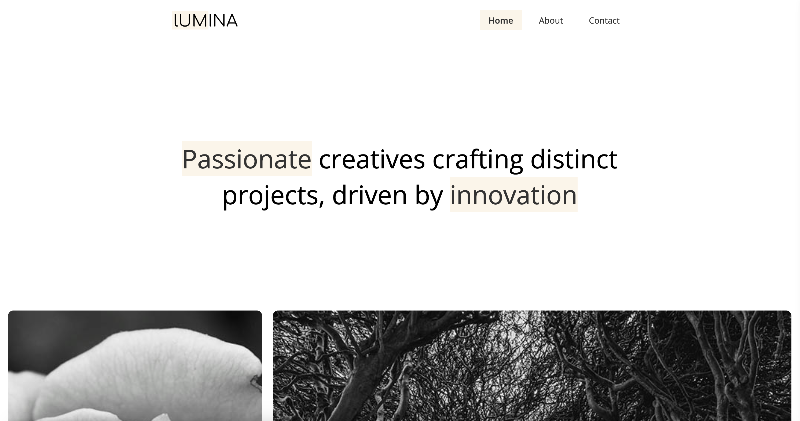

# Lumina Creative

A modern and visually stunning portfolio website designed for showcasing creative projects. This project features a responsive gallery with lightbox functionality, making it perfect for photographers, designers, and other creatives to display their work.

## Features

- **Responsive Design**: Fully responsive layout that adapts seamlessly to all screen sizes.
- **Interactive Gallery**: A grid-based gallery with lightbox functionality for viewing images in full size.
- **Customizable Content**: Easily update images, titles, and text to suit your portfolio needs.
- **Social Media Integration**: Includes links to popular social media platforms for easy sharing.
- **Contact Section**: Displays contact information for potential clients or collaborators.

## Technologies Used

- HTML
- CSS
- JavaScript
- Lightbox2 for image viewing
- Font Awesome for icons

## How to Use

- Clone the repository.
- Open `index.html` in your browser.
- Browse the gallery and click on images to view them in the lightbox.
- Customize the content by editing the HTML and CSS files.
